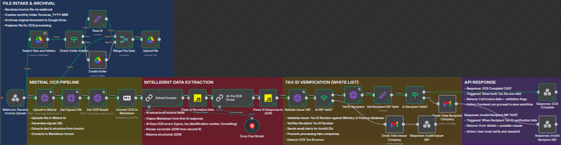
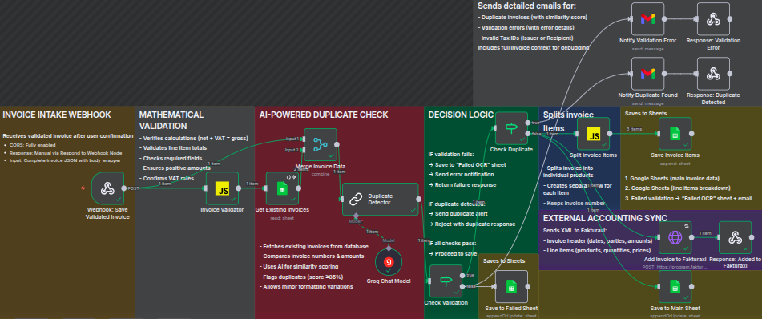
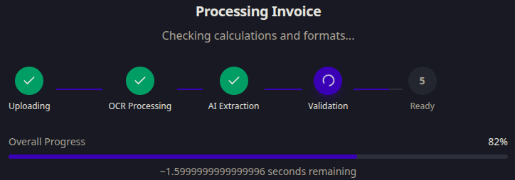
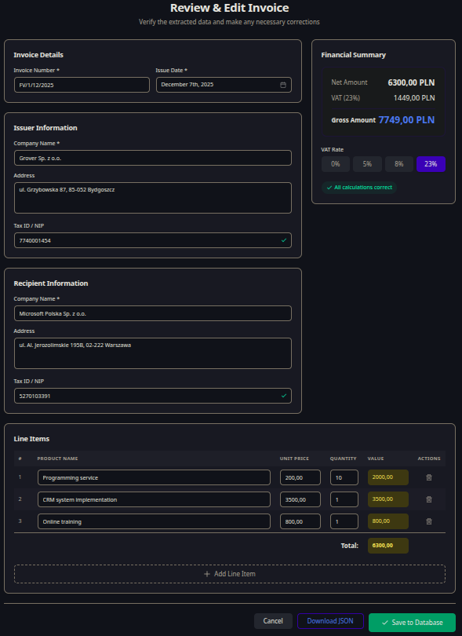
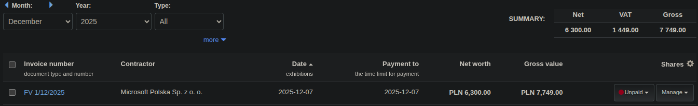
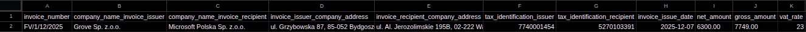
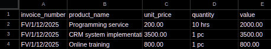

# AI Invoice OCR Automation

Advanced invoice OCR pipeline built in n8n that combines OCR technology, artificial intelligence, data validation, and automatic synchronization with external accounting system.

## Main Project Goal

**Data Flow:** Lovable.dev (Invoice Processor) → n8n workflows → fakturaxl.pl

The system enables:
1. Invoice upload through web interface in Lovable.dev
2. Automatic OCR processing with AI
3. Verification and error correction by AI
4. Duplicate detection
5. Automatic addition to fakturaxl.pl accounting system

---

## Table of Contents

- [Overview](#overview)
- [Features](#features)
- [Architecture](#architecture)
- [Workflows](#workflows)
  - [Workflow 1: AI-Powered Invoice OCR & Data Extraction](#workflow-1-ai-powered-invoice-ocr--data-extraction)
  - [Workflow 2: Invoice Validation & Storage](#workflow-2-invoice-validation--storage)
- [Technology Stack](#technology-stack)
- [Usage](#usage)
- [API Endpoints](#api-endpoints)
- [Error Handling](#error-handling)
- [Google Sheets Structure](#google-sheets-structure)

---

## Overview

The project automates the complete invoice processing pipeline from document upload in the web interface to integration with the accounting system. It uses AI for intelligent OCR correction, validates data mathematically, detects duplicates, and synchronizes with Fakturaxl accounting software.

### Key Capabilities

- Invoice upload through web interface (PDF, images)
- Structured data extraction using Mistral AI OCR
- AI-powered OCR error correction (typos, formatting, value merging)
- Tax ID (NIP) verification in Ministry of Finance database (White List API)
- Mathematical validation of invoice calculations
- AI-powered duplicate detection (similarity scoring)
- Automatic synchronization with Fakturaxl system
- Storage in Google Sheets with line item breakdown
- Email notifications for errors and exceptions

---

## Features

### Document Processing

- Multi-format support (PDF, PNG, JPG, TIFF)
- Automatic monthly archiving in Google Drive
- High-accuracy OCR by Mistral AI
- Markdown conversion for structured data extraction

### AI Intelligence

**Two-stage AI processing (extraction + correction)**

Automatic fixing:
- Typos in company names
- Broken Tax ID numbers
- Invoice number formatting
- Currency decimal separator errors
- Merged VAT values
- Space removal in amounts

Context-aware field mapping for Polish and English invoices

### Validation and Verification

**Mathematical Validation:**
- Verification: Net + VAT = Gross
- Line item calculation checks
- Sum of items = net amount
- Required field validation
- VAT rate compliance (0%, 5%, 8%, 23%)
- Product array length consistency

Tax ID Verification via White List API

### Duplicate Detection

- AI-powered similarity scoring
- Fuzzy matching for invoice numbers
- Comparison: company name + amount
- Configurable threshold (default 85%)
- Detailed duplicate reports

### Data Storage

- Primary storage: Google Sheets (invoice data)
- Secondary storage: Google Sheets (line item breakdown)
- Failed OCR tracking sheet
- Monthly Google Drive archival
- External sync: Fakturaxl API

### User Experience

- Real-time processing feedback
- Visual data confirmation interface
- Edit capability before final save
- Comprehensive error messages
- Email notifications for admin intervention

---

## Architecture

The system consists of two main workflows that communicate via webhooks:

```
┌─────────────────────────────────────────────────────────────┐
│                 Frontend (Lovable.dev)                      │
│  - File upload interface                                    │
│  - Data review and editing                                  │
│  - Confirmation workflow                                    │
└────────────┬────────────────────────────┬───────────────────┘
             │                            │
        POST /OCR                    POST /save-invoice
             │                            │
             v                            v
┌────────────────────────┐    ┌──────────────────────────────┐
│   Workflow 1: OCR      │    │   Workflow 2: Validation     │
│   & Data Extraction    │───▶│   & Storage                  │
└────────────────────────┘    └──────────────────────────────┘
             │                            │
             v                            v
┌────────────────────────┐    ┌──────────────────────────────┐
│  Mistral AI OCR        │    │  Google Sheets               │
│  Groq LLaMA 3.3 70B    │    │  Fakturaxl API               │
│  White List API        │    │  Gmail Notifications         │
└────────────────────────┘    └──────────────────────────────┘
```

---

## Workflows

## Workflow 1: AI-Powered Invoice OCR & Data Extraction

**Visualization:** 


This workflow handles the initial document processing and data extraction.

### Processing Steps

#### 1. File Intake
- Receives invoice via webhook (`POST /OCR`)
- Validates file format
- Prepares binary data for processing

#### 2. Google Drive Archival
- Searches for monthly folder (`Invoices_YYYY-MM`)
- Creates folder if doesn't exist
- Archives original document

#### 3. Mistral OCR Pipeline
- Uploads file to Mistral AI
- Generates signed URL
- Performs OCR extraction
- Returns structured markdown

#### 4. AI Data Extraction
- Processes markdown with Groq LLaMA 3.3 70B
- Extracts all invoice fields
- Maps Polish/English terminology
- Returns structured JSON

#### 5. AI Error Correction
- Second AI pass for OCR error fixing
- Corrects typos, formatting, merged values
- Validates Tax ID formats
- Returns cleaned JSON

#### 6. Tax ID Verification
- Validates Issuer Tax ID against White List API
- Validates Recipient Tax ID
- Checks both against Ministry of Finance database
- Returns validation flags

#### 7. Response Generation
- **Success (200):** Returns complete invoice data with validation flags
- **Invalid Issuer (400):** Error response with details
- **Invalid Recipient (400):** Error response with possible causes

### Node Configuration

---
---

**Entry Point:**
- `Webhook: Receive Invoice Upload` - Entry point for file uploads from Lovable.dev interface

---
---

**FILE INTAKE & ARCHIVAL**

**Google Drive Archival:**
- `Search files and folders` - Searches for monthly folder (format: Invoices_YYYY-MM)
- `Check Folder Exists?` - IF condition: checks if monthly folder exists
- `Create folder` - Creates new monthly folder if missing
- `Pass ID` - Passes folder ID to next steps
- `Merge File Data` - Merges folder ID with file data
- `Upload file` - Archives original invoice to Google Drive

---
---

**MISTRAL OCR PIPELINE**

**Mistral OCR Processing:**
- `Upload to Mistral` - Uploads file to Mistral AI API
- `Get Signed URL` - Generates temporary signed URL for document access
- `Get OCR Result` - Performs OCR extraction
- `Convert OCR to Markdown` - Converts OCR pages array to structured Markdown format


---
---

**INTELLIGENT DATA EXTRACTION**

**AI Data Processing:**
- `Extract Invoice` - Extracts all invoice fields from Markdown
- `Clean & Normalize Data` - Code node that cleans Markdown artifacts from first AI response and parses to JSON
- `AI: Fix OCR Errors` - Corrects OCR errors (typos, formatting, merged values)
- `Parse AI Response to JSON` - Code node that cleans Markdown artifacts from second AI response and parses to JSON
- `Groq Chat Model` - Model configuration (llama-3.3-70b-versatile)

---
---

**TAX ID VERIFICATION (WHITE LIST)**

**Tax ID Validation:**
- `Validate Issuer NIP` - HTTP Request to White List API for issuer tax ID verification
- `Is NIP Valid?` - IF condition: checks if issuer Tax ID is valid in Ministry of Finance database
- `Verify Recipient` - HTTP Request to White List API for recipient tax ID verification
- `Is Recipient Valid?` - IF condition: checks if recipient Tax ID is valid
- `Set Recipient NIP Valid` - Sets validation flag for valid recipient

---
---

**API RESPONSE**

**Success Path:**
- `Response: OCR Complete` - Returns complete invoice data with validation flags (HTTP 200)

**Error Paths:**
- `Email: Fake Issuer Company` - Gmail notification for invalid issuer tax ID
- `Response: Invalid Issuer NIP` - Error response for invalid issuer (HTTP 400)
- `Email: Fake Recipient Company` - Gmail notification for invalid recipient tax ID
- `Response: Invalid Recipient NIP` - Error response for invalid recipient (HTTP 400)

---

## Workflow 2: Invoice Validation & Storage

**Visualization:** 


This workflow validates data, checks for duplicates, and stores the invoice.

### Processing Steps

#### 1. Data Reception
- Receives validated invoice via webhook (`POST /save-invoice`)
- Extracts invoice data from request body

#### 2. Mathematical Validation
- Verifies: `net_amount + VAT = gross_amount`
- Validates line item calculations
- Checks sum of items = net amount
- Validates required fields
- Ensures positive amounts
- Confirms VAT rate compliance

#### 3. Duplicate Detection
- Fetches existing invoices from Google Sheets
- AI compares current invoice with database
- Calculates similarity score
- Flags duplicates if score ≥ 85%

#### 4. Decision Logic

**If validation fails:**
- Saves to "Failed OCR" sheet
- Sends email notification
- Returns 409 error response

**If duplicate detected:**
- Sends duplicate alert email
- Returns 409 duplicate response

**If all checks pass:**
- Proceeds to storage

#### 5. Data Storage
- Saves main invoice data to Google Sheets
- Splits line items to separate sheet
- Sends XML to Fakturaxl API

#### 6. External Sync
- Constructs XML payload
- Posts to Fakturaxl API
- Handles sync errors gracefully
- Returns final response (201)

### Node Configuration

---
---

**Entry Point:**
- `Webhook: Save Validated Invoice` - Receives validated/edited invoice data from Lovable.dev interface

---
---

**INVOICE INTAKE WEBHOOK**

**Data Reception:**
- Receives complete invoice JSON with user edits
- Input: Full invoice object with all fields
- Compatible invoice structure with both workflows

---
---

**MATHEMATICAL VALIDATION**

**Validation Logic:**
- `Invoice Validator` - Code node that performs mathematical validation:
  - Verifies: net_amount + VAT = gross_amount
  - Validates line item calculations
  - Checks sum of items = net amount
  - Validates required field presence
  - Ensures positive amounts
  - Confirms VAT rate compliance (0%, 5%, 8%, 23%)
  - Checks product array length consistency

---
---

**AI-POWERED DUPLICATE CHECK**

**Duplicate Detection:**
- `Get Existing Invoices` - Fetches all existing invoices from Google Sheets
- `Merge Invoice Data` - Merges current invoice with database for comparison
- `Duplicate Detector`:
  - AI compares current invoice with existing database
  - Calculates similarity score (fuzzy matching)
  - Checks: invoice number, company names, amounts, dates
  - Flags duplicates if similarity ≥ 85%
- `Groq Chat Model` - Model configuration (llama-3.3-70b-versatile)

---
---

**DECISION LOGIC**

**Validation Check:**
- `Check Validation` - IF condition: determines if validation passed
  - If FAIL → routes to error path
  - If PASS → proceeds to duplicate check

**Duplicate Check:**
- `Check Duplicate` - IF condition: determines if duplicate detected
  - If DUPLICATE → routes to duplicate alert path
  - If UNIQUE → proceeds to storage

---
---

**SPLITS INVOICE ITEMS**

**Data Processing:**
- `Split Invoice Items` - Code node that:
  - Separates line items from main invoice data
  - Creates separate rows for each product
  - Preserves invoice metadata for each item
  - Prepares data structure for items sheet

---
---

**DECISION LOGIC - ERROR PATHS**

**Validation Failed Path:**
- `Save to Failed Sheet` - Saves failed invoice to "Failed OCR" sheet for manual review
- `Notify Validation Error` - Sends detailed Gmail notification with error list
- `Response: Validation Error` - Returns HTTP 409 with validation errors JSON

**Duplicate Detected Path:**
- `Notify Duplicate Found` - Sends Gmail notification with similarity score and matched invoice
- `Response: Duplicate Detected` - Returns HTTP 409 with duplicate details JSON

---
---

**EXTERNAL ACCOUNTING SYNC**

**Success Path - Storage:**
- `Save to Main Sheet` - Saves main invoice data to Google Sheets (primary storage)
- `Save Invoice Items` - Saves line items to separate Google Sheets (secondary storage)
- `Add Invoice to Fakturaxl` - HTTP POST request to Fakturaxl API with XML payload
- `Response: Added to Fakturaxl` - Returns HTTP 201 success with Fakturaxl sync confirmation

---

## Technology Stack

### Core Technologies

- **n8n:** Workflow automation platform
- **Node.js:** Runtime environment
- **JavaScript:** Scripting language

### AI

- **Mistral AI:** OCR processing
  - Model: `mistral-ocr-latest`
  - Features: Image base64 extraction, multi-page support
- **Groq Cloud:** LLM inference
  - Model: `llama-3.3-70b-versatile`
  - Use cases: Data extraction, error correction, duplicate detection

### APIs & Integrations

- **Google Drive API:** Document archival
- **Google Sheets API:** Data storage
- **Gmail API:** Email notifications
- **White List API:** Tax ID verification (Polish Ministry of Finance)
- **Fakturaxl API:** Accounting system sync

### Data Formats

- **Input:** PDF, PNG, JPG, TIFF
- **Processing:** Markdown, JSON
- **Output:** JSON, XML (Fakturaxl), CSV (Sheets)

---

## Usage

### Basic Workflow



**Step 1:** Upload invoice via web interface



**Step 2:** Review extracted data and make corrections if needed



**Step 3:** Invoice synchronized to Fakturaxl accounting system

### Step-by-Step Process

#### 1. Upload Invoice
- Navigate to web interface
- Drag and drop invoice file
- Click "Process Invoice"
- Wait for OCR processing (10-30 seconds)

#### 2. Review Data
System displays extracted fields. Verify accuracy of:
- Invoice number
- Company names
- Tax IDs
- Dates
- Amounts
- Line items

#### 3. Edit if Needed
- Click "Edit" button
- Modify any incorrect fields
- Ensure Tax IDs are valid
- Verify calculations

#### 4. Confirm and Save
- Click "Save Invoice"
- System performs validation
- Checks for duplicates
- Saves to database
- Syncs to Fakturaxl

#### 5. Verify Storage
- Check Google Sheets for new entry
- Verify Fakturaxl dashboard
- Confirm email notifications (if any errors)

### Data Flow

```
Upload → OCR → AI Extract → AI Correct → Tax ID Verify → 
User Review → Validate → Duplicate Check → Save → Sync → Complete
```

---

## API Endpoints

### Workflow 1: OCR & Data Extraction

**Endpoint:** `POST /OCR`

**Request:**
```
Method: POST
Content-Type: multipart/form-data
Body: File upload (binary)
```

**Response (Success - 200):**
```json
{
  "invoice_number": "FAK/001/2025",
  "company_name_invoice_issuer": "Example Corp Ltd.",
  "company_name_invoice_recipient": "Client Company Sp. z o.o.",
  "invoice_issuer_company_address": "ul. Main Street 10, 00-001 Warsaw",
  "invoice_recipient_company_address": "ul. Client Street 5, 00-002 Warsaw",
  "tax_identification_issuer": "1234567890",
  "tax_identification_recipient": "0987654321",
  "invoice_issue_date": "2025-01-15",
  "net_amount": "1000.00",
  "gross_amount": "1230.00",
  "vat_rate": "23",
  "product_name": ["Product A", "Product B"],
  "unit_price": ["500.00", "500.00"],
  "quantity": ["1", "1"],
  "value": ["500.00", "500.00"],
  "nip_issuer_valid": true,
  "nip_recipient_valid": true,
  "white_list_data": {
    "result": {
      "subject": {
        "name": "Client Company Sp. z o.o.",
        "nip": "0987654321",
        "statusVat": "Czynny"
      }
    }
  }
}
```

**Response (Invalid Tax ID - 400):**
```json
{
  "success": false,
  "error_code": "INVALID_ISSUER_TAX_ID",
  "message": "The Issuer's Tax ID could not be verified in the Ministry of Finance database",
  "details": {
    "invoice_number": "FAK/001/2025",
    "invalid_issuer_nip": "1234567890",
    "company_name": "Example Corp Ltd."
  },
  "action_required": "Please verify the Issuer's Tax ID and resubmit",
  "timestamp": "2025-12-12T10:30:00Z"
}
```

### Workflow 2: Validation & Storage

**Endpoint:** `POST /save-invoice`

**Request:**
```
Method: POST
Content-Type: application/json
Body: Invoice JSON (from Workflow 1 response)
```

**Response (Success - 201):**
```json
{
  "success": true,
  "message": "Invoice successfully added to Fakturaxl accounting system",
  "invoice_data": {
    "invoice_number": "FAK/001/2025",
    "issue_date": "2025-01-15",
    "company_issuer": "Example Corp Ltd.",
    "company_recipient": "Client Company Sp. z o.o.",
    "net_amount": "1000.00",
    "gross_amount": "1230.00",
    "vat_rate": "23%",
    "currency": "PLN"
  },
  "fakturaxl_response": {
    "status": "success",
    "raw_response": {
      "kod": "1",
      "info": "Document added successfully"
    }
  },
  "storage": {
    "google_sheets": "Saved to main sheet and items sheet",
    "fakturaxl": "Synchronized with external accounting system"
  },
  "next_steps": "Invoice is now available in your Fakturaxl dashboard",
  "timestamp": "2025-12-12T10:31:00Z"
}
```

**Response (Validation Failed - 409):**
```json
{
  "success": false,
  "error_code": "VALIDATION_FAILED",
  "message": "Invoice validation failed - mathematical errors detected",
  "validation": {
    "is_valid": false,
    "error_count": 2,
    "warning_count": 0,
    "errors": [
      {
        "field": "gross_amount",
        "message": "Gross amount mismatch: Expected 1230.00, got 1250.00",
        "expected": "1230.00",
        "actual": "1250.00",
        "difference": "20.00"
      }
    ],
    "warnings": []
  },
  "action_required": "Please review and correct the validation errors listed above, then resubmit the invoice.",
  "timestamp": "2025-12-12T10:31:00Z"
}
```

**Response (Duplicate Detected - 409):**
```json
{
  "success": false,
  "error_code": "DUPLICATE_INVOICE",
  "message": "This invoice already exists in the database",
  "duplicate_detection": {
    "is_duplicate": true,
    "similarity_score": 95,
    "matched_invoice_number": "FAK/001/2025",
    "reason": "Exact match found in database"
  },
  "action_required": "This invoice has already been processed. If this is a legitimate resubmission, please contact support.",
  "timestamp": "2025-12-12T10:31:00Z"
}
```

---

## Error Handling

### Error Types

**OCR Processing Errors:**
- File format not supported
- Mistral API timeout
- OCR extraction failed
- Invalid response format

**Validation Errors:**
- Mathematical calculation mismatches
- Missing required fields
- Invalid Tax IDs
- Negative amounts
- Array length inconsistencies

**Duplicate Detection Errors:**
- Similar invoice found (score ≥ 85%)
- Exact invoice number match
- Same parties and amounts

**Sync Errors:**
- Fakturaxl API unreachable
- Invalid XML format
- Authentication failure
- API rate limit exceeded

### Email Notifications

System sends detailed email notifications for:

**1. Invalid Tax IDs**
- Subject: "VALIDATION ERROR: Invalid Issuer Tax ID"
- Contains: Full invoice details, rejection reason, next steps

**2. Duplicate Invoices**
- Subject: "Duplicate Invoice Detected"
- Contains: Similarity score, matched invoice, comparison data

**3. Validation Failures**
- Subject: "Validation Failed - Invoice [NUMBER]"
- Contains: List of errors, invoice details, action required

**4. Fake Company Detection**
- Subject: "DATA ERROR: Invalid Recipient Tax ID"
- Contains: Possible causes (OCR error, private individual, typo)

### Retry Mechanism

All external API calls include automatic retries:
- Retry count: 3 attempts
- Wait between tries: 2000ms (2 seconds)
- Applies to:
  - Mistral AI API
  - White List API
  - Fakturaxl API

### Error Recovery

**Failed OCR Sheet:**
- All failed invoices saved to dedicated sheet
- Manual review and reprocessing possible
- Preserves original data for debugging

**Never Error Mode:**
- Enabled on critical nodes
- Returns errors as data instead of stopping workflow
- Allows graceful degradation

---

## Google Sheets Structure



*Main invoice data storage*



*Invoice line items data storage*

The system uses two main sheets for data storage:

**Main OCR Sheet:**
- Stores complete invoice data
- One row per invoice
- Contains all metadata fields

**Invoice Line Items Sheet:**
- Stores broken-down invoice items
- One row per item/product
- Maintains reference to parent invoice

**Failed OCR Sheet:**
- Stores invoices that failed validation
- For manual review and correction
- Contains error details